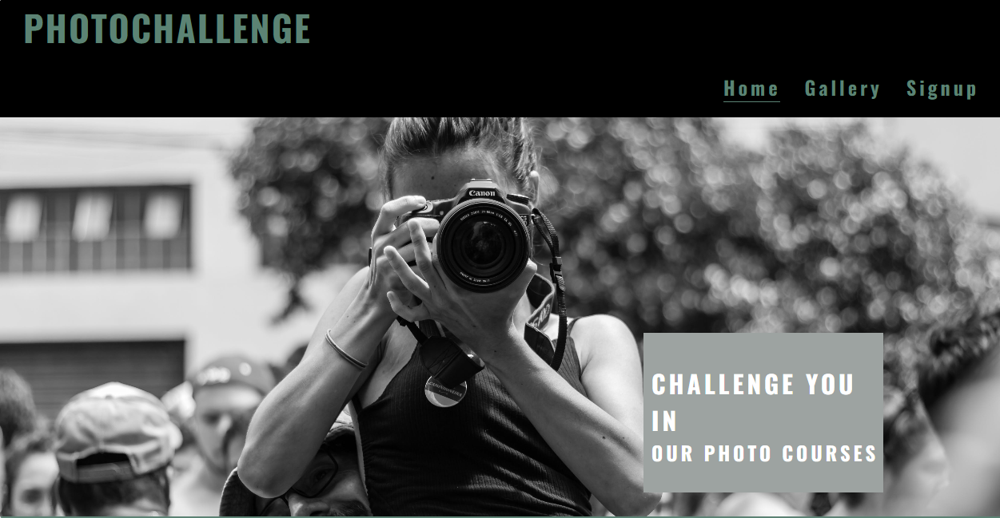
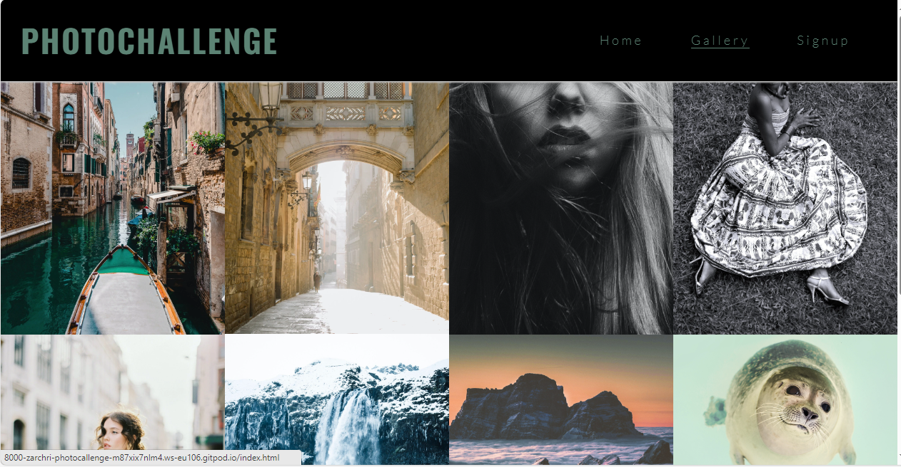
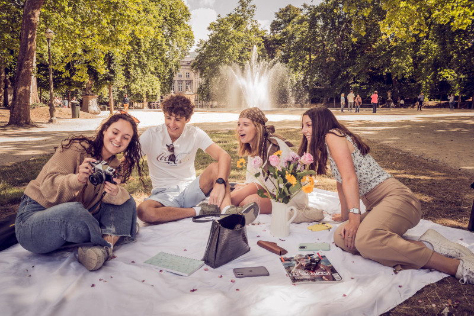
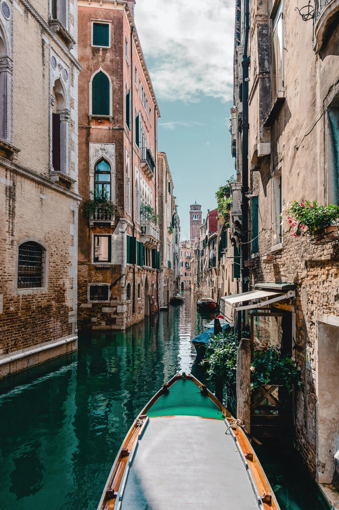

# Photochallenge

Visit the deployed site: [Photochallenge](https://github.com/zarchri/photocallenge/actions/runs/6916105787)

Callenge your self in our photocourses

We have courses both for new beginner and for you who have insperience and want width your wievs. We have also a photocourse for yoy who wants learn you redigering.
Our phototravels is very popular.

## CONTENTS

* [User Experience](#user-experience-ux)
  * [User Stories](#user-stories)

* [Design](#design)
  * [Colour Scheme](n my css file I have used variables to declare colours, and then used these throughout the css file. 
  From the beginning I had a idea about I want it black because I realy like black and white images and want a black and white image in the homepaige in the end it ended with black header background wit a green touch in the text.

I have used #000000 and 5C8374 as the primary and secondary colours used for the sites text.

I have used #5C8374 for the border-hover effect of the formsection.

I have used #ffffff in the input-text in the formsection.)
  * [Typography](Google Fonts was used to import the chosen fonts for use in the site.)

For the Page Title I have used the google font Oswald. I chooce this font because I want A font who clearly Shows the title on the page.

For the body of the page I have used the google font Lato. Lato is a sans-serif font like the mosy website use, it is a clean and easy to read.

  * [Imagery]
  (-In the home page I want use a picture with a person with a camera so the person get intention.
  -In the gallery I have chosen picture who can interact with the travelgoal we will go to in the different phototravels
  -In the fornmsection I chooce this picture because I want show thee feeling to photographs togheter and get inspiration from each other.)

  * [Wireframes](#wireframes)
  * [Features](The website is comprised of a home page, a gallery page, a signup page, a 404 error page & a 500 error page.

All Pages on the website are responsive and have:

A favicon in the browser tab.

favicon

The title of the site at the top of every page. This title also acts as a link back to the home page. The title are: Photochallenge

Every page will display a custom cursor when on a button. This feature is not available on mobile touch devices.)
    * [The Home Page](#https://8000-zarchri-photocallenge-m87xix7nlm4.ws-eu106.gitpod.io/index.html)
    * [The Gallery Page](#https://8000-zarchri-photocallenge-m87xix7nlm4.ws-eu106.gitpod.io/gallery.html)
    * [The Signup Page](#https://8000-zarchri-photocallenge-m87xix7nlm4.ws-eu106.gitpod.io/signup.html)
    * [The 404 Error Page](#the-404-error-page)
    * [Future Implementations](#future-implementations)
  * [Accessibility](#accessibility)

* [Technologies Used](#technologies-used)
  * [Languages Used](#languages-used)
  * [Frameworks, Libraries & Programs Used](#frameworks-libraries--programs-used)

* [Deployment & Local Development](#deployment--local-development)
  * [Deployment](#deployment)
  * [Local Development](#local-development)
    * [How to Fork](#how-to-fork)
    * [How to Clone](#how-to-clone)

* [Testing](#testing)
  * [Solved Bugs](#solved-bugs)
  * [Known Bugs](#known-bugs)
  
* [Credits](#credits)
  * [Code Used](#code-used)
  * [Content](#content)
  * [Media](#media)
  * [Acknowledgments](#acknowledgments)

- - -

## User Experience (UX)

### User Stories

#### First Time Visitor Goals

* I want to explore my photographs skills and gain more inspiration and learn the basics of editing
* I want to meet new people with the same interest in photography like me
* I have recently developed an interest in photography and want to learn the basics

#### Returning Visitor Goals

* I want to learn more editing

#### Frequent Visitor Goals

* I want to grow in my photography.
* I want to broaden my horizons and expand my portfolio

- - -

## Design

### Colour Scheme

From the befinning I wanted most of a black theme but only chose black and white would be little booring so I decided to change the white color to lightgreen.

In my css file I have used black and lightgreen color

* I have used `#000000` & '#5C8374' as the primary and secondary colours used for the sites text.

* I have used #5C8374 in the borders in the formsection.

  

### Typography

Google Fonts was used to import the chosen fonts for use in the site.

* For the Page Title I have used the google font [Oswald](@import url('https://fonts.googleapis.com/css2?family=Lato:ital@1&family=Oswald:wght@200;300;400;500;600;700&family=Satisfy&display=swap');). I chooce satisfy because I want a font who is easy to read for everyone it is clean and clear.

* For the body of the page I have used the google font [Lato](@import url('https://fonts.googleapis.com/css2?family=Lato:ital@1&family=Oswald:wght@200;300;400;500;600;700&family=Satisfy&display=swap');). 

### Imagery

I want use a image who associates with photo so I chooce a girl with a camera.

### Wireframes

Wireframes were created for mobile, tablet and desktop using balsamiq.

### Features

The website is comprised of a home page, a gallery page and a signup page, a 404 error page & a 500 error page.

All Pages on the website are responsive and have:

* A favicon in the browser tab.

  

* The title of the site at the top of every page. This title also acts as a link back to the home page.
  

In all page you can fint in the footer contact information: adress, phone, email and social media links

#### The Home Page

The home page of Photochallenge displays the sites name as a title and then a container which holds information about the the courses we hold about what they are container, place, time and amount.

#### The Gallery Page

The gallery page displays the sites name as a title. This also acts as a link back to the home page. Here can you see photographs from the different country we have travell to and what photoredigering can do, this page is for little inspirations.

#### The Signup Page

The Signup page displays the sites name as a title. This also acts as a link back to the home page. In this page can you sign you up to our different courses. 
IN the background have I chooce  a image with happy teenager with a camera in a picknic in the nature.

#### The 404 Error Page

The 404 error page displays the sites name as a title. This also acts as a link back to the home page. Within the page container there is a sorry message explaining to the user that there has been an error directing them to the page they were looking for. The user is then given a choice of three buttons to redirect them to other pages on the site, the home page, the games page and the high scores page.

#### The 500 Error Page

The 500 error page displays the sites names as a title, which also acts as a link back to the home page. Within the container is an error message that tells the user sorry there seems to be an issue retrieving the quiz data. Two buttons for the home page and the high scores page are below. I did not add the play game button here, as a user will been directed to this page if there is an error calling the API.

#### Future Implementations

In future implementations I would like to:

1. Efford onlines courses.
2. add narrator function for the hearing impaired
3. Expand the gallery page with more pictures and different folders with both pictures taken of objects and people on our trips but also pictures of the participants in the courses
4. Style the homepage more there information about the courses are more clear and conspicuous.

### Accessibility

I have been mindful during coding to ensure that the website is as accessible friendly as possible. This has been have achieved by:

* Using semantic HTML.
* Using a hover state on all buttons on the site to make it clear to the user if they are hovering over a button.
* Choosing a sans serif font for the site 
-easy for everyone to read.
* Ensuring that there is a sufficient colour contrast throughout the site.

## Technologies Used

### Languages Used

HTML, CSS, Javascript

### Frameworks, Libraries & Programs Used

* [Balsamiq](https://balsamiq.com/) - Used to create wireframes.

* [Git](https://git-scm.com/) - For version control.

* [Github](https://github.com/) - To save and store the files for the website.

* [GitPod](https://gitpod.io/) - IDE used to create the site.

* [Google Fonts](https://fonts.google.com/) - To import the fonts used on the website.

* [Pexels](https://www.pexels.com/sv-se/)
Load down images

* [Google Developer Tools](https://developers.google.com/web/tools) - To troubleshoot and test features, solve issues with responsiveness and styling.

* [TinyPNG](https://tinypng.com/) To compress images

* [gimp](redigeringsprogramme) To resize images.

* [Favicon.io](https://favicon.io/) To create favicon.

* [Am I Responsive?](http://ami.responsivedesign.is/) To show the website image on a range of devices.

* [Shields.io](https://shields.io/) To add badges to the README

* [Webpage Spell-Check](https://chrome.google.com/webstore/detail/webpage-spell-check/mgdhaoimpabdhmacaclbbjddhngchjik/related) - a google chrome extension that allows you to spell check your webpage. Used to check the site and the readme for spelling errors.

- - -

## Deployment & Local Development

### Deployment

The site is deployed using GitHub Pages - [Photochallenge](https://github.com/zarchri/photocallenge).

To Deploy the site using GitHub Pages:

1. Login (or signup) to Github.
2. Go to the repository for this project, [zarchri/photochallenge](https://github.com/zarchri/photocallenge).
3. Click the settings button.
4. Select pages in the left hand navigation menu.
5. From the source dropdown select main branch and press save.
6. The site has now been deployed, please note that this process may take a few minutes before the site goes live.

### Local Development

#### How to Fork

To fork the repository:

1. Log in (or sign up) to Github.
2. Go to the repository for this project, [zarchri/photocallenge](https://github.com/zarchri/photocallenge)
3. Click the Fork button in the top right corner.

#### How to Clone

To clone the repository:

1. Log in (or sign up) to GitHub.
2. Go to the repository for this project, [zarchri/photocallenge](https://github.com/zarchri/photocallenge)
3. Click on the code button, select whether you would like to clone with HTTPS, SSH or GitHub CLI and copy the link shown.
4. Open the terminal in your code editor and change the current working directory to the location you want to use for the cloned directory.
5. Type 'git clone' into the terminal and then paste the link you copied in step 3. Press enter.

- - -

## Testing

Please refer to [TESTING.md](TESTING.md) file for all testing carried out.

### Solved Bugs

| No | Bug | How I solved the issue |
| :--- | :--- | :--- |
| 1 | I use code anywhere from the beginning, but it was problem with that programme| I change to gitpod, it works fine|
| 2 | MY image in my homepage was not showing | But i get help with one in slack and the problem was I must clean my cach end then it works |

### Known Bugs

* In the mobile media queries the cover text in the homepage is not center, I have also problem with the header the menu-icon is not in the header there I want it would be and the title in the header is center and not in left.

 * The favicon-icon with a camera is not showing

- - -

## Credits

### Code Used

I research in W3school after the code I needed and in the videos in the code institute course.
and chatGPT

### Content

All content are written from my self

### Media

#homepage

#gallery 

#Signup page

### Acknowledgments

I would like to acknowledge the following people:

* Jubril- My Code Institute Mentor.

* Friend and famyly for their support

* member of slack comunity who have helped me when I struggled

* Tutor-team- who have been a realy good help
