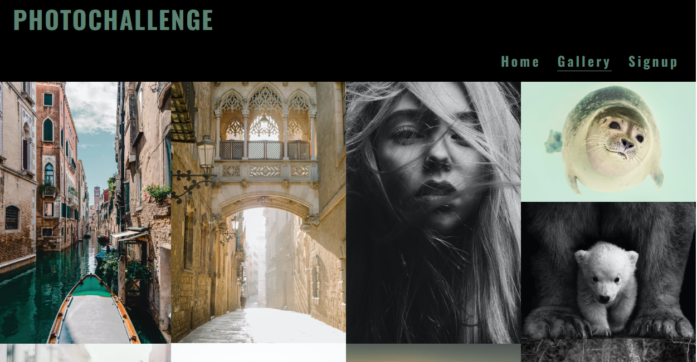
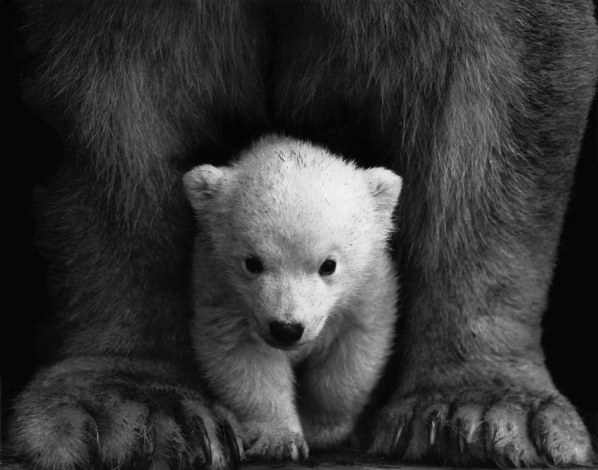

# Photochallenge

Photoshop 

Callenge your self in our photocourses

We have courses both for new beginner and for you who have insperience and want width your wievs. We have also a photocourse for you who wants learn you redigering.
Our phototravels is very popular and the parcipants get friends and memory for the life.

### Features

The website is comprised of a home page, a gallery page and a signup page, a 404 error page & a 500 error page.

All Pages on the website are responsive and have:

* A favicon in the browser tab.

  

* The title of the site at the top of every page. This title also acts as a link back to the home page.

  

In all page you can find in the footer contact information: adress, phone, email and social media links

#### The Home Page

The home page of Photochallenge displays the sites name as a title and then a container which holds information about the the courses we hold about what they are container, place, time and amount.

#### The Gallery Page

The gallery page displays the sites name as a title. This also acts as a link back to the home page. Here can you see photographs from the different country we have travell to and what photoredigering can do, this page is for little inspirations.

#### The Signup Page

The Signup page displays the sites name as a title. This also acts as a link back to the home page. In this page can you sign you up to our different courses. 
In the background have I chooce  a image with happy teenager with a camera in a picknic in the nature.

## CONTENTS

 * Google Fonts was used to import the chosen fonts for use in the site.

For the Page Title I have used the google font Oswald. I chooce this font because I want A font who clearly Shows the title on the page.

For the body of the page I have used the google font Lato. Lato is a sans-serif font like the mostly website use, it is a clean and easy to read.

  * [Imagery]
  (In the home page I want use a picture with a person with a camera so the person get intention.
  -In the gallery I have chosen picture who can interact with the travelgoal we will go to in the different phototravels
  -In the fornm-section I chooce this picture because I want show the feeling to photographs togheter and get inspiration from each other.)

  
  * [Features]The website is comprised of a home page, a gallery page, a signup page, a 404 error page & a 500 error page.

  

* [Deployment & Local Development](https://8000-zarchri-photocallenge-m87xix7nlm4.ws-eu106.gitpod.io/index.html)
 
   

* [Testing](#testing)
  * [Solved Bugs](#solved-bugs)
  * [Known Bugs](#known-bugs)
  
* [Credits](#credits)
  * [Code Used](#code-used)
  * [Content](#content)
  * [Media](#media)
  * [Acknowledgments](#acknowledgments)

- - -

 

## Design

### Colour Scheme
* In my css file I have used variables to declare colours, and then used these throughout the css file. 
  From the beginning I had a idea about I want it black because I realy like black and white images and want a black and white image in the homepage in the end it ended with black header background wit a green touch in the text.
* I have used `#000000` & '#5C8374' as the primary and secondary colours used for the sites text.

I have used #ffffff in the input-text in the formsection.
From the befinning I wanted most of a black theme but only chose black and white would be little booring so I decided to change the white color to lightgreen.

I have used #5C8374 for the border-hover effect of the formsection.

### Media

The images was taken from [Pexels](https://www.pexels.com/sv-se/sok/people%20%20in%20group%20with%20a%20camera/?orientation=landscape "Pexels")

#homepage

#gallery 

#Signup page

## Technologies Used

### Languages Used

HTML, CSS.

### Libraries & Programs Used

### Content

* All content in the homepage was written from my self.

* [Github](https://github.com/) - To save and store the files for the website.

* [GitPod](https://gitpod.io/) - IDE used to create the site.

* [Google Fonts](https://fonts.google.com/) - To import the fonts used on the website.

* [Pexels](https://www.pexels.com/sv-se/)
Load down images

* [TinyPNG](https://tinypng.com/) To compress images

* [gimp](redigeringsprogramme) To resize images.

* [Favicon.io](https://favicon.io/) To create favicon.

* [Font awesome](https://fontawesome.com/search) - To load down the fonts to the social media in the footers

* [Am I Responsive?](http://ami.responsivedesign.is/) To show the website image on a range of devices.

- - -

## Testing

Please visit to [TESTING.md](TESTING.md) file for all testing carried out.

### Solved Bugs

| No | Bug | How I solved the issue |
| :--- | :--- | :--- |
| 1 | I use code anywhere from the beginning, but it was problem with that programm| I change to gitpod, it works fine|
| 2 | My image in my homepage was not showing | But i get help with one in slack and the problem was I must clean my cach and then it works |
| 3 | The favicon was not showing | Tutor support helped me, the problem was my file paths I had miss added assets|
| 4 | I had problem with the media queries | The problem was that I had for much code with "float"|

### Known Bugs

* In the mobile media queries the cover text in the homepage is not center, I have also problem with the header the menu-icon is not in the header there I want it would be and the title in the header is center and not in left.

 

Visit the deployed site: [Photochallenge](https://github.com/zarchri/photocallenge/actions/runs/6916105787)

## Credits

### Code Used

I research in W3school after the code I needed and in the videos in the code institute course.
and chatGPT

#### Future Implementations

In future implementations I would like to:

1. Efford onlines courses.
2. add narrator function for the hearing impaired
3. Expand the gallery page with more pictures and different folders with both pictures taken of objects and people on our trips but also pictures of the participants in the courses
4. Style the homepage more there information about the courses are more clear and conspicuous.

### Acknowledgments

I would like to acknowledge the following people:

* Jubril- My Code Institute Mentor.

* Friend and family for their support

* member of slack comunity who have helped me when I struggled

* Tutor-team- who have been a realy good help
